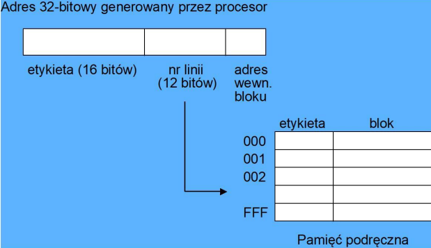
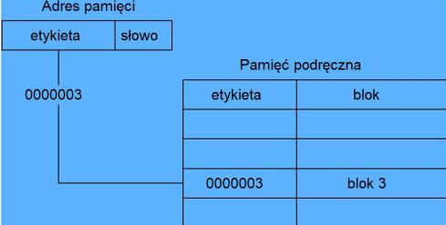

# Pamięć cache
## Bezpośrednie

## Asocjacyjne

## Translacja adresu
Przypisanie wartości na podstawie podanego adresu
### Adresowanie bezpośrednie

Przykład mamy:
- adres **12345678H**

| Etykieta | Nr linii | Adres wewn. bloku |
|----------|----------|-------------------|
| 16 bit   | 12 bit   | 4 bit             |

Dla podanego adresu mamy:

| Etykieta | Nr linii | Adres wewn. bloku |
|----------|----------|-------------------|
| 1234H    | 567H     | 8H                |

### Adresowanie asocjacyjne
Podobnie jak w bezpośrednim tylko nie mamy numeru linii.
Czyli dla adresu **12345678H** oraz

| Etykieta | Offset   |
|----------|----------|
| 16 bit   | 16 bit   |

Analogicznie mamy:

| Etykieta | Offset   |
|----------|----------|
| 1234H    | 5678H    |

## Liczenie pamięci cashe

### Przykład (zadanie z wykładu)

Jaki jest całkowity rozmiar pamięci podręcznej, która pomieści 8 KB danych w liniach (blokach) o wielkości 8 bajtów i zakładając 32 bitowy adres?

### Rozwiązanie
- Dla 8 bajtowego bloku potrzebny **offsetu = 3 bity** (bo 8=$2^3$ Uwaga wielkość bloku musi być podana w bajtach bo offset robimy na bajtach, a nie bitach)

- dla $ 8 KB = 8 * 2^{10} B $  danych i **8 B** bloku danych jest potrzebne $ \frac{8*2^{10}}{8} = 2^{10} $ lini
- Czyli długość pola nr. linii wynosi 10 bitów
- Wielkość etykiety: 32 - 10 - 3 = 19 bitów

| Etykieta | Nr linii | Adres wewn. bloku |
|----------|----------|-------------------|
| 19 bitów    | 10 bitów     | 3 bity     |

Rozmiar pojedynczej linii to:

Etykieta + blok + (ewentualny bit kontrolny)

$$ 19 + 64 + 1 = 84 bity $$

Wielkość pamięci cache:
$$ 84 * 2^{10} b = \frac{84 * 2^10}{8}B = 10 752B = 10.752 KB $$

## A co by było w przypadku adresowania asocjacyjnego

- Offset dalej wynosi **3 bity**, tutaj się nic nie zmienia.
- Natomiast etykieta wynosi teraz: **32 - 3 = 29 bitów**
- więc długość 1 linii wynosi: **29 + 64 = 93 bity**

Wielkość pamięci cache:
$$ 93 * 2^{10} b = \frac{93 * 2^{10}}{8} B = 11 094 B = 11.094 KB $$
